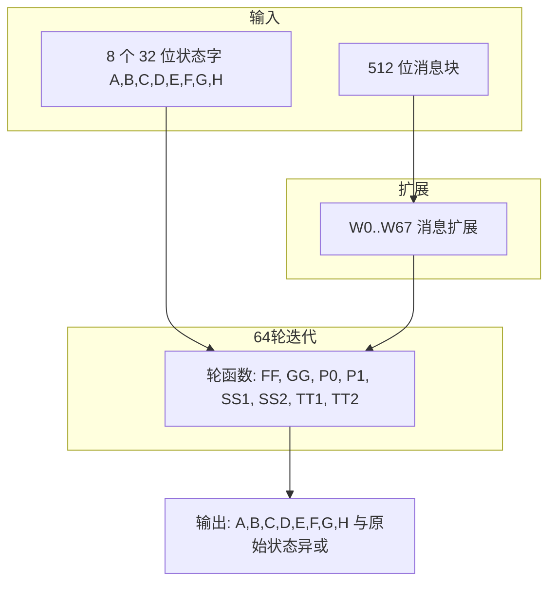
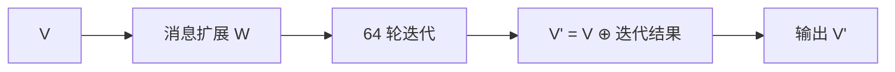

# SM3 密码杂凑算法

## 1. 算法概述

SM3 是中国国家密码管理局发布的密码杂凑算法（GM/T 0004-2012），输出 256 位（32 字节）摘要。结构类似 SHA-256，采用 Merkle-Damgård 迭代，压缩函数为 64 轮迭代结构。

---

## 2. 数学基础

### 2.1 基本参数

| 参数 | 值 |
|------|-----|
| 摘要长度 | 256 位 (32 字节) |
| 分组大小 | 512 位 (64 字节) |
| 初始值 IV | 8 个 32 位字 |
| 轮数 | 64 |

### 2.2 初始值 IV

```
IV[0..7] = 
  0x7380166F, 0x4914B2B9, 0x172442D7, 0xDA8A0600,
  0xA96F30BC, 0x163138AA, 0xE38DEE4D, 0xB0FB0E4E
```

---

## 3. 压缩函数流程



### 3.1 消息扩展

将 16 个 32 位字 W[0..15] 扩展为 W[0..67]：

\[
W[j] = P_1(W[j-16] \oplus W[j-9] \oplus \mathrm{Rotl}_{15}(W[j-3])) \oplus \mathrm{Rotl}_7(W[j-13]) \oplus W[j-6]
\]

其中 j = 16..67。

---

## 4. 消息填充

1. 追加比特 1
2. 补 0 直至长度 ≡ 448 (mod 512)
3. 将消息比特长度（64 位大端）追加到末尾

填充后总长度为 512 的整数倍。

---

## 5. 轮函数

### 5.1 布尔函数 FF、GG

\[
\mathrm{FF}_j(X,Y,Z) = \begin{cases}
X \oplus Y \oplus Z & j < 16 \\
(X \wedge Y) \vee (X \wedge Z) \vee (Y \wedge Z) & j \ge 16
\end{cases}
\]

\[
\mathrm{GG}_j(X,Y,Z) = \begin{cases}
X \oplus Y \oplus Z & j < 16 \\
((Y \oplus Z) \wedge X) \oplus Z & j \ge 16
\end{cases}
\]

### 5.2 置换函数 P0、P1

\[
P_0(X) = X \oplus \mathrm{Rotl}_9(X) \oplus \mathrm{Rotl}_{17}(X)
\]

\[
P_1(X) = X \oplus \mathrm{Rotl}_{15}(X) \oplus \mathrm{Rotl}_{23}(X)
\]

### 5.3 轮常量 T、K

- T[0..15] = 0x79CC4519
- T[16..63] = 0x7A879D8A
- K[j] = Rotl(T[j], j mod 32)

### 5.4 压缩迭代（每轮 j=0..63）

\[
\mathrm{SS1} = \mathrm{Rotl}_7(\mathrm{Rotl}_{12}(A) + E + K[j])
\]
\[
\mathrm{SS2} = \mathrm{SS1} \oplus \mathrm{Rotl}_{12}(A)
\]
\[
\mathrm{TT1} = \mathrm{FF}_j(A,B,C) + D + \mathrm{SS2} + (W[j] \oplus W[j+4])
\]
\[
\mathrm{TT2} = \mathrm{GG}_j(E,F,G) + H + \mathrm{SS1} + W[j]
\]

然后：D←C, C←Rotl(B,9), B←A, A←TT1, H←G, G←Rotl(F,19), F←E, E←P0(TT2)

---

## 6. 压缩函数（单块）流程



---

## 7. C 源码与 Python 模块对应

| GmSSL C 源文件 | Python 模块 | 功能 |
|----------------|-------------|------|
| `sm3.c` | `_sm3.py` | SM3 哈希、压缩函数、IV、消息填充 |

### 函数映射

| C 函数/宏 | Python 实现 |
|-----------|-------------|
| `sm3_init` | `SM3State.__init__` |
| `sm3_update` | `SM3State.update` |
| `sm3_finish` | `SM3State.finalize` |
| `sm3_digest` | `sm3_hash` |
| `sm3_compress` | `_compress` |
| `SM3_IV` | `_IV` |
| `SM3_T` | `_T` |
| `SM3_K` (轮常量) | `_K` |
| `FF`, `GG` | `_ff`, `_gg` |
| `P0`, `P1` | `_p0`, `_p1` |

---

## 8. 实现说明

- **纯 Python**：无外部加密库依赖，便于审计
- **32 位运算**：使用 `& 0xFFFFFFFF` 保证 32 位模运算
- **流式接口**：`update()` 支持增量输入，`finalize()` 完成填充并输出摘要
- **常量**：IV、T、K 在模块加载时预计算
