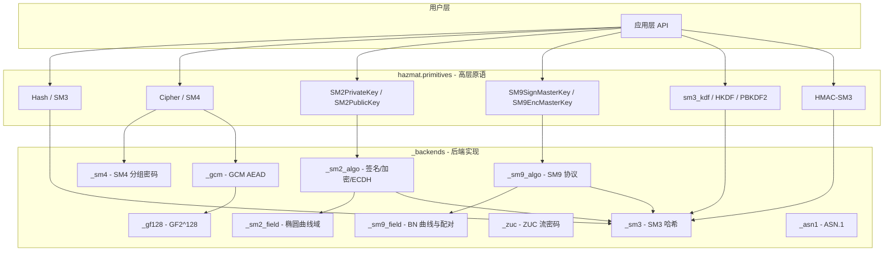
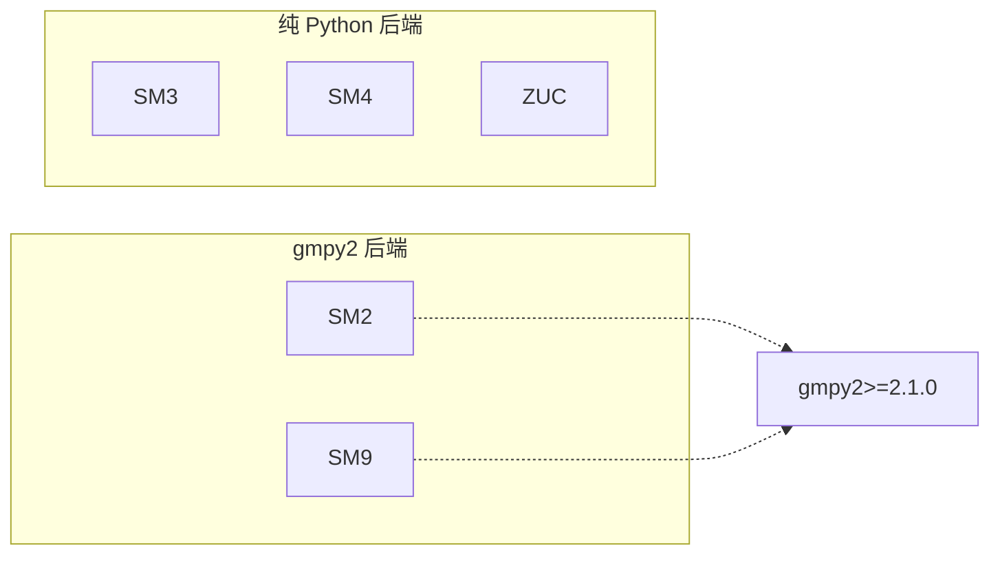
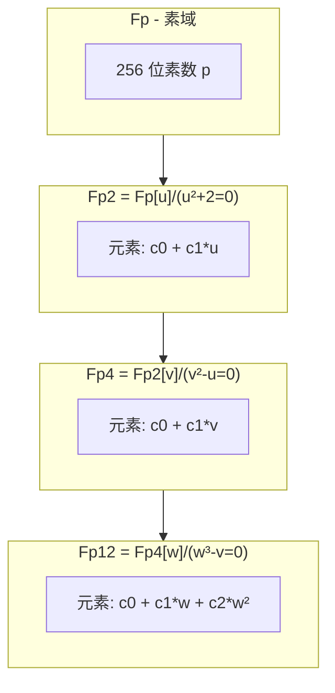

# GmSSL Python SDK 架构文档

## 1. 项目概述

GmSSL Python SDK 实现了中国国家密码管理局发布的商用密码算法标准，包括：

| 算法 | 标准 | 用途 |
|------|------|------|
| SM2 | GM/T 0003-2012 | 椭圆曲线数字签名、公钥加密、密钥交换 |
| SM3 | GM/T 0004-2012 | 密码杂凑算法（哈希） |
| SM4 | GM/T 0002-2012 | 分组密码（对称加密） |
| SM9 | GM/T 0044-2016 | 基于身份的密码学 |
| ZUC | 3GPP TS 35.221 | 流密码（4G/5G 加密） |

本 SDK 参考 GmSSL C 库实现，提供 cryptography-lib 风格的 Python API，适用于国密算法的集成与开发。

---

## 2. 模块层次结构



---

## 3. API 设计哲学（cryptography-lib 风格）

### 3.1 分层设计

- **hazmat（危险品）层**：暴露底层原语，供高级库或专家用户使用，需谨慎操作。
- **算法描述符模式**：如 `SM3()`、`SM4(key)`、`CBC(iv)` 描述算法/模式，再传入 `Hash`、`Cipher` 等构造器。
- **密钥对象封装**：`SM2PrivateKey` / `SM2PublicKey` 提供 `sign`、`verify`、`encrypt`、`decrypt` 等接口。
- **流式接口**：Hash、HMAC、Cipher 使用 `update()` + `finalize()` 模式。

### 3.2 典型用法示例

```python
# 哈希
Hash(hashes.SM3()).update(data).finalize()

# 分组密码
Cipher(algorithms.SM4(key), modes.CBC(iv)).encryptor().update(pt).finalize()

# SM2
private_key = sm2.generate_private_key()
sig = private_key.sign(data)
public_key.verify(sig, data)

# SM9
master = sm9.generate_sign_master_key()
user_key = master.extract_key("alice@example.com")
sig = user_key.sign(data)
```

---

## 4. 后端实现策略



| 算法 | 实现方式 | 依赖 | 说明 |
|------|----------|------|------|
| **SM2** | gmpy2 | `gmpy2>=2.1.0` | 256 位素域、雅可比坐标、大整数运算 |
| **SM9** | gmpy2 | `gmpy2>=2.1.0` | BN 曲线、Fp2/Fp4/Fp12 扩域塔、R-ate 配对 |
| **SM3** | 纯 Python | 无 | 32 位字运算 |
| **SM4** | 纯 Python | 无 | S 盒 + L 变换、32 轮 Feistel |
| **ZUC** | 纯 Python | 无 | LFSR + F 函数，支持 ZUC-128/256 |

选择 gmpy2 的原因：SM2/SM9 涉及 256 位及以上素域运算，gmpy2 提供高性能多精度整数运算与模逆。

---

## 5. SM9 扩域塔（Extension Field Tower）

SM9 基于 BN 曲线，配对计算在 Fp12 上进行。扩域塔结构如下：



| 域 | 不可约多项式 | Python 类 | 坐标 |
|----|-------------|-----------|------|
| Fp | — | `mpz` | 256 位素域 |
| Fp2 | u² + 2 = 0 | `Fp2(c0, c1)` | c0, c1 ∈ Fp |
| Fp4 | v² - u = 0 | `Fp4(c0, c1)` | c0, c1 ∈ Fp2 |
| Fp12 | w³ - v = 0 | `Fp12(c0, c1, c2)` | c0, c1, c2 ∈ Fp4 |

- **G1**：曲线 E(Fp): y² = x³ + 5
- **G2**：扭曲曲线 E'(Fp2)
- **配对**：R-ate 配对 e: G1 × G2 → Fp12*

---

## 6. 辅助模块

| 模块 | 功能 |
|------|------|
| `_utils.py` | `xor_bytes`、`constant_time_compare` |
| `_gf128.py` | GF(2^128) 运算，用于 GHASH |
| `_gcm.py` | SM4-GCM AEAD |
| `padding.py` | PKCS7 填充（CBC 模式） |
| `hmac.py` | HMAC-SM3 |
| `kdf/sm3kdf.py` | SM3-KDF（GM/T 0003-2012） |
| `kdf/hkdf.py` | HKDF |
| `kdf/pbkdf2.py` | PBKDF2 |

---

## 7. GmSSL C 中暂未实现的 Python 模块

- TLS/TLCP 协议栈
- X.509 / CMS / PKCS8 证书与消息格式
- SM4 硬件加速（AES-NI/AVX）
- SM3 AVX2 并行
- SM2 盲签名、环签名、ElGamal、密钥恢复等扩展算法
